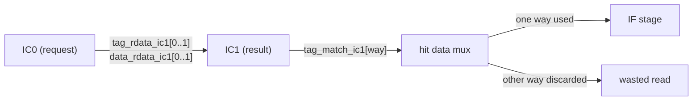
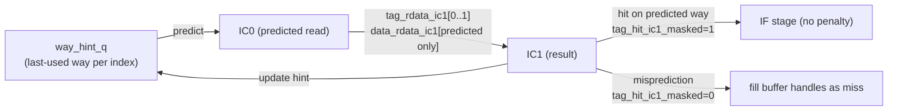

# ICache Way-Prediction for Data RAM Power Reduction

## Background

From `rtl/ibex_pkg.sv`, key constants:

- `IC_NUM_WAYS = 2` (2-way set associative)
- `IC_INDEX_W = $clog2(IC_NUM_LINES)` (set index width)
- `IC_LINE_SIZE = 64` bits per cache line

The only file that needs to change is `[rtl/ibex_icache.sv](rtl/ibex_icache.sv)`.

## Current Pipeline Flow




Both data RAMs are read unconditionally in IC0. One way's result is always discarded in IC1.

## Proposed Flow (with way-prediction)




## Why Misprediction is Suppressed (not re-read)

The fill buffer is tightly coupled to the IC1 result. On misprediction, `data_rdata_ic1[correct_way]` was never read so the hit data mux produces zeros. If `fill_hit_ic1[fb]` fires (as it would without masking), it captures wrong data into `fill_data_q[fb]` and the fill buffer outputs wrong instructions to IF.

A data-RAM-only re-read cannot fix this cleanly because `fill_hit_q[fb]` is already set with wrong data before the re-read completes.

The correct solution is to mask `tag_hit_ic1` on misprediction (`tag_hit_ic1_masked = tag_hit_ic1 & ~way_mispredict_ic1`), so the fill buffer sees a miss and fetches from the bus. The data is still in cache and will be re-cached on the fill write. This is the correct, simple approach.

## Changes to `rtl/ibex_icache.sv`

### Step 1 — Signal declarations (~line 200, after existing declarations)

```systemverilog
// Way-prediction
logic [IC_INDEX_W-1:0] way_hint_index_q;   // set index of last hint update
logic                  way_hint_q;          // predicted way: 0 or 1
logic                  way_hint_en;
logic                  predicted_way_ic0;   // IC0: which way to read
logic                  predicted_way_ic1_q; // pipelined to IC1
logic                  way_mispredict_ic1;  // hit but on wrong way
logic                  tag_hit_ic1_masked;  // tag_hit suppressed on misprediction
```

Note: `lookup_index_ic1_q` is NOT needed. In this version of the RTL, `lookup_index_ic1` is already a top-level signal registered in both the `g_lookup_addr_ra` and `g_lookup_addr_nr` IC0→IC1 pipeline blocks. Use `lookup_index_ic1` directly everywhere below.

### Step 2 — Register lookup index into IC1 — NO CHANGE NEEDED

`lookup_index_ic1` is already declared at the top level and registered in both pipeline blocks:

```systemverilog
// Already present in g_lookup_addr_ra and g_lookup_addr_nr:
lookup_index_ic1 <= lookup_addr_ic0[IC_INDEX_HI:IC_LINE_W];
```

Use `lookup_index_ic1` directly in Steps 3 and 5 below. No new register or signal needed.

### Step 3 — Prediction logic (before IC0 data RAM section, ~line 270)

```systemverilog
// Predict which way will hit using the last-used way for this set index.
// Default to way 0 on cold start or index mismatch.
assign predicted_way_ic0 =
    (lookup_index_ic0 == way_hint_index_q) ? way_hint_q : 1'b0;

// Pipeline predicted way to IC1
always_ff @(posedge clk_i) begin
  if (lookup_grant_ic0)
    predicted_way_ic1_q <= predicted_way_ic0;
end

// Misprediction: a hit occurred on the OTHER (non-predicted) way
assign way_mispredict_ic1 = lookup_valid_ic1 & tag_hit_ic1
                           & ~tag_match_ic1[predicted_way_ic1_q];

// Suppress the hit so fill buffer treats misprediction as a miss
assign tag_hit_ic1_masked = tag_hit_ic1 & ~way_mispredict_ic1;

// Update hint on every hit (correct or mispredicted — use unmasked tag_hit_ic1 so that a
// misprediction also updates the hint to the correct way for the next access)
assign way_hint_en = lookup_valid_ic1 & tag_hit_ic1;

always_ff @(posedge clk_i) begin
  if (way_hint_en) begin
    way_hint_index_q <= lookup_index_ic1;   // use existing global signal
    way_hint_q       <= tag_match_ic1[1];   // 1 if way 1 hit
  end
end
```

### Step 4 — Replace `data_banks_ic0` (~line 275)

Old:

```systemverilog
assign data_banks_ic0 = tag_banks_ic0;   // reads ALL ways every lookup
```

New (one-hot select of predicted way; ECC and fill write paths unchanged):

```systemverilog
assign data_banks_ic0 =
    ecc_write_req  ? ecc_write_ways                          :
    fill_grant_ic0 ? fill_ram_req_way                        :
                     (IC_NUM_WAYS'(1) << predicted_way_ic0);
```

### Step 5 — Replace `tag_hit_ic1` with `tag_hit_ic1_masked` in two downstream sites

`**fill_hit_ic1` inside `gen_fbs` for loop (~line 614):**

```systemverilog
// Old:
assign fill_hit_ic1[fb] = lookup_valid_ic1 & fill_in_ic1[fb] & tag_hit_ic1    & ~ecc_err_ic1;
// New:
assign fill_hit_ic1[fb] = lookup_valid_ic1 & fill_in_ic1[fb] & tag_hit_ic1_masked & ~ecc_err_ic1;
```

`**ecc_err_ic1` inside the `gen_data_ecc_checking` generate block (~line 451, ICacheECC=1 path only):**

When ICacheECC=0, line 512 assigns `ecc_err_ic1 = 1'b0` unconditionally — that branch is untouched.

```systemverilog
// Old (inside gen_data_ecc_checking):
assign ecc_err_ic1 = lookup_valid_ic1 & (((|data_err_ic1) & tag_hit_ic1)    | (|tag_err_ic1));
// New:
assign ecc_err_ic1 = lookup_valid_ic1 & (((|data_err_ic1) & tag_hit_ic1_masked) | (|tag_err_ic1));
```

## Cycle-by-Cycle Timing


| Cycle | IC0 action                                               | IC1 action                                                                 |
| ----- | -------------------------------------------------------- | -------------------------------------------------------------------------- |
| T     | Read tag RAM (both ways) + data RAM (predicted way only) | —                                                                          |
| T+1   | Normal next lookup                                       | Tag compare: correct prediction → `tag_hit_ic1_masked=1`, data flows to IF |
| T+1   | Normal next lookup                                       | Misprediction → `tag_hit_ic1_masked=0`, fill buffer fetches from bus       |
| T+1   | —                                                        | Hint register updated with correct way                                     |


## Expected Impact


| Scenario                          | Data RAM reads before | After                      |
| --------------------------------- | --------------------- | -------------------------- |
| Sequential hit (>95% of accesses) | 2                     | 1                          |
| Way misprediction (<5%)           | 2                     | 1 read + full miss penalty |
| Cache miss                        | 2                     | 1                          |


For CoreMark (sequential instruction fetch, high locality), close to **50% reduction in data RAM read dynamic power** with negligible IPC impact.

## Measurement

Run lint first to catch type/width errors:

```bash
IBEX_CONFIG_OPTS=$(./util/ibex_config.py maxperf-pmp-bmfull-icache fusesoc_opts)
fusesoc --cores-root . run --target=lint --tool=verilator lowrisc:ibex:ibex_top_tracing $IBEX_CONFIG_OPTS
```

Then run CoreMark before and after:

```bash
./ci/run-cosim-test.sh --skip-pass-check CoreMark \
    examples/sw/benchmarks/coremark/coremark.elf
cat ibex_simple_system_pcount.csv
```

Compare `Fetch Wait`, `Cycles`, and `Instructions Retired`.