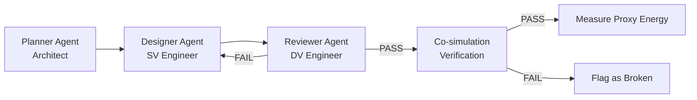

# AI Prompting Methodology

This document describes the LLM-based optimization pipeline used to generate RTL modifications for the Ibex I-cache. The framework uses a three-agent architecture (Planner, Designer, Reviewer) to systematically propose, implement, and verify power optimizations.

## Pipeline Overview



Each agent is a separate LLM prompt with a defined role, constrained scope, and explicit instructions. The agents operate in sequence: the Planner analyzes baseline metrics and proposes an optimization, the Designer implements it in SystemVerilog, and the Reviewer audits the implementation for correctness before it enters co-simulation.

All RTL changes are constrained to a single file (`ibex_icache.sv`) to limit blast radius and simplify verification.

## Agent Prompts

### 1. Planner Agent

**Role:** Principal Power & Performance Architect

The Planner receives baseline performance counter data (from `ibex_simple_system_pcount.csv`) and proposes a single, specific RTL optimization targeting proxy energy reduction.

```text
You are the **Planner Agent**. Your role is **Principal Power & Performance Architect**.
Your goal is to analyze the repository and propose concrete RTL modifications to optimize
the Ibex Instruction Cache for power.

**Context:** We are working within the Ibex RISC-V core repository, specifically focusing
**ONLY on `ibex_icache.sv`**. The primary metric for success is reducing proxy energy
(calculated via `util/icache_proxy_energy.py` using Tag Array Reads, Data Array Reads, etc.).

Here are the baseline performance metrics from `ibex_simple_system_pcount.csv` for our
workload (CoreMark):
- **Baseline (RR):**
  [PASTE RR BASELINE CSV DATA HERE]
- **Baseline (PLRU):**
  [PASTE PLRU BASELINE CSV DATA HERE]

**Instructions:**
1. Analyze the baseline metrics to identify where the bulk of the power is being consumed
   (e.g., Tag reads vs Data reads).
2. Propose **one** specific, realistic RTL optimization for the cache. Focus on something
   that is practical to implement in a single iteration.
3. Identify the relevant signals to edit within `ibex_icache.sv`. Do not suggest changes
   outside this file.
4. If you need any clarifications about the codebase or synthesis parameters (like
   `ICachePLRU`), ask before finalizing the plan.
```

**Key design choices:**
- Baseline data is pasted directly into the prompt so the LLM reasons from actual numbers, not hypotheticals.
- The single-file constraint prevents the LLM from proposing changes that would require coordinated edits across the core hierarchy.
- Asking for "one" optimization per iteration keeps plans focused and reviewable.

### 2. Designer Agent

**Role:** Senior SystemVerilog Design Engineer

The Designer receives the Planner's proposal and produces the actual RTL code changes.

```text
You are the **Designer Agent** (Executor). Your role is **Senior SystemVerilog Design
Engineer**. Your goal is to implement a specific optimization plan precisely as described,
ensuring clean and efficient RTL implementation.

**Context:** You are working in the Ibex RISC-V core repository, specifically targeting
the Instruction Cache power optimizations. You must restrict all your edits to **only
`ibex_icache.sv`**.

**Task:** Build Plan [INSERT PLAN NUMBER/NAME HERE] from the Planner's proposals.

**Instructions:**
1. Read the provided plan carefully.
2. Make sure to cover everything in the plan exactly.
3. Write the necessary SystemVerilog code changes. Ensure your changes follow the existing
   `lowrisc` coding style (e.g., using `always_ff`, non-blocking assignments for registers,
   and trailing block comments like `end // block_name`).
4. Output the exact code blocks to be added, modified or deleted, clearly specifying the
   line numbers/surrounding context within `rtl/ibex_icache.sv`.
5. **CRITICAL:** When saving the final optimized file, save it to the following directory:
   `CDA5106-Final-Project/RTL Optimized`. Give it a descriptive name like
   `icache_optimization_N_name.sv`.
```

**Key design choices:**
- Explicit coding style constraints (lowRISC conventions) reduce style drift.
- Requiring line-number context helps the human operator verify where changes go.
- Output is saved as a separate file, preserving the original for diffing.

### 3. Reviewer Agent

**Role:** Senior Design Verification (DV) Engineer

The Reviewer compares the Designer's output against the original plan and audits for functional hazards.

```text
You are the **Reviewer Agent**. Your role is **Senior Design Verification (DV) Engineer**.
Your goal is to verify that the implementation matches the plan and has not introduced
functional logic hazards or style regressions. The changes you make must not break the
verification test that CoreMark has in place.

**Context:** The Designer Agent has just generated a new optimized version of
`ibex_icache.sv` in the `RTL Optimized/` directory based on an optimization plan.
[link optimization file]

**Instructions:**
1. Review the changes made by the Designer Agent and compare them against the original
   plan: [INSERT ORIGINAL PLAN TEXT HERE].
2. Make sure everything in the plan was executed properly and no steps were missed.
3. Audit the newly added RTL for obvious functional hazards (e.g., failure to un-gate a
   signal on a branch redirect, or accidental creation of latches in combinational logic
   blocks).
4. Conclude with a PASS or FAIL rating based on your visual inspection of the code diff.
```

**Key design choices:**
- The Reviewer sees both the plan and the implementation, enabling completeness checking.
- Specific hazard examples (un-gated signals, accidental latches) prime the LLM to look for common RTL pitfalls.
- The PASS/FAIL gate is a human-readable checkpoint before investing simulation time.

## How the Pipeline Was Used

### Iteration Flow

For each optimization attempt:

1. **Planner** received the baseline JSON data and proposed an optimization with signal-level specifics.
2. **Designer** implemented the plan as a new `ibex_icache.sv` variant.
3. **Reviewer** audited the diff and issued PASS/FAIL.
4. On PASS, the variant was run through the co-simulation pipeline (`run_all.sh`) to verify functional correctness against Spike and measure proxy energy.

### Planner Outputs

The Planner produced three optimization plans (stored in `ibex/plans/`):

| Plan | File | Proposed Optimization |
|------|------|----------------------|
| Op 1-2 | `icache_planner_agent_coremark_op1-2.md` | Line buffer for same-line fetch suppression; identified that tag+data reads are ~97% of proxy energy |
| Op 2 | `icache_planner_agent_coremark_op2.md` | Extended line buffer with universal capture and fill-write invalidation |
| Op 3 | `icache_planner_agent_coremark_op3.md` | Three-technique combination: line buffer, fill-buffer suppression, prefetch throttling |

Each plan included baseline energy breakdowns, signal-level change lists, and expected impact estimates.

### Human Intervention: Opt 4

After Opts 2 and 3 failed co-simulation due to the complexity of the agent's proposed changes, the human operator re-engaged the pipeline with a modified constraint: instead of allowing the agent to propose arbitrary RTL modifications, it was asked to suggest a **small, non-destructive change** that tunes an existing mechanism rather than introducing new logic. The agent identified the `FB_THRESHOLD` constant as an existing tuning knob that was set conservatively and recommended lowering it from `NUM_FB - 2` to `NUM_FB - 3`. This human-guided iteration produced the project's best result (14.2% proxy energy reduction) while passing co-simulation cleanly.

### Post-Measurement Analysis Prompt

After running simulations, a separate prompt template was used to analyze results and suggest next steps:

```text
We are optimizing the Ibex instruction cache replacement policy.

Context:
- Workload: <workload name>
- Config: <IBEX_CONFIG used>
- Two runs differ only by I$ victim policy: RR vs PLRU
- Proxy energy computed from counters:
  E = 1*TagReads + 2*DataReads + 2*TagWrites + 3*DataWrites + 1*Evictions + 1*InvalTagWrites

Here are the per-run JSON summaries (RR and PLRU):
<paste JSON here>

Tasks:
1) Decide which policy is better for this workload under this proxy metric, and why.
2) Identify which counters dominate E and which deltas matter most.
3) Suggest 2-3 next experiments to disambiguate.
4) Do a sensitivity check: if we vary the weights, does the recommendation change?

Constraints:
- Do not change functional behavior; only replacement policy and counter instrumentation
  are in scope.
- Prefer lightweight policies that do not add timing-critical logic.
```

Guidelines for interpreting LLM analysis output:
- Treat LLM suggestions as **hypotheses** to validate via additional simulation runs.
- Prefer suggestions that map to measurable counter changes (e.g., "reduce tag reads") over vague advice.
- If a suggestion implies changing proxy weights, re-run `icache_proxy_energy.py` with those weights to quantify sensitivity.

## Results and Lessons Learned

### Outcome Summary

| Optimization | Complexity | Reviewer | Co-sim | Source |
|-------------|-----------|----------|--------|--------|
| Opt 1: Line buffer | Moderate (new state, bypass logic) | PASS | PASS | LLM pipeline |
| Opt 2: Seq. LB + FB suppression | High (multi-mechanism interaction) | PASS | **FAIL** | LLM pipeline |
| Opt 3: Combined (all techniques) | Very high (3 interacting mechanisms) | PASS | **FAIL** | LLM pipeline |
| Opt 4: FB threshold | Trivial (one constant) | PASS | PASS | LLM pipeline (human-constrained) |

### Key Findings

1. **LLM review is insufficient for functional correctness.** The Reviewer Agent passed Opts 2 and 3 based on code inspection, but both failed Spike co-simulation. LLM-based review catches style and plan-adherence issues but misses subtle state machine interactions that only emerge during execution.

2. **Complexity correlates with failure.** Opt 1 (single mechanism, moderate complexity) passed. Opts 2-3 (multiple interacting mechanisms) failed. The failure mode involves corner-case interactions between fill-buffer state, line-buffer state, and the existing cache FSM that are difficult to reason about from code alone.

3. **Human constraints unlock the best results.** After the complex Opts 2-3 failed, re-engaging the pipeline with an explicit "small, non-destructive change" constraint produced Opt 4 — a single constant change that achieved 14.2% proxy energy reduction, far exceeding Opt 1's modest improvement. The LLM correctly identified `FB_THRESHOLD` as a tuning knob, but only when steered away from adding new logic.

4. **The pipeline is most valuable for analysis and constrained generation.** The Planner's baseline energy breakdown (identifying that tag+data reads are ~97% of proxy energy) correctly focused attention on the right optimization target. The analysis prompts produced useful hypotheses. Unconstrained Designer implementations introduced functional bugs, but when the scope was tightly constrained, the agent produced correct and effective RTL.

### Recommendations for Future Use

- **Use LLMs for analysis and planning**, where hallucination risk maps to wasted time, not broken hardware.
- **Keep LLM-generated RTL changes minimal** — single-mechanism changes with clear pre/post conditions.
- **Always verify with co-simulation** — never trust LLM review alone for functional correctness.
- **Provide the LLM with concrete data** (baseline counters, existing code) rather than abstract descriptions.
- **Constrain the edit scope** (single file, one optimization per iteration) to limit blast radius.
