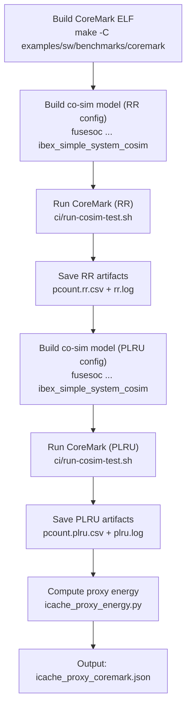

# Measurement Methodology

This document describes the proxy energy model, measurement pipeline, replacement policy configurations, and the result artifacts produced by the simulation flow.

## Proxy Energy Model

Absolute power measurement requires synthesis and gate-level simulation with switching-activity annotation, which is expensive and tool-dependent. Instead, we use a **proxy energy metric** derived from I-cache SRAM activity counters that correlates with dynamic power consumption.

### Formula

```
E = w_tr * TagReads + w_dr * DataReads + w_tw * TagWrites + w_dw * DataWrites + w_ev * Evictions + w_inv * InvalTagWrites
```

### Default Weights

| Weight | Value | Counter | Rationale |
|--------|-------|---------|-----------|
| w_tr | 1.0 | Tag Reads | Tag SRAM is small (2-way tags); lowest per-access energy |
| w_dr | 2.0 | Data Reads | Data SRAM is physically larger than the tag array; higher capacitance per access |
| w_tw | 2.0 | Tag Writes | Writes dissipate more energy than reads due to bit-cell flipping |
| w_dw | 3.0 | Data Writes | Largest array + write operation; highest per-access energy |
| w_ev | 1.0 | Evictions | Eviction itself is a control event; the associated write is already counted in data/tag writes |
| w_inv | 1.0 | Invalidation Tag Writes | Infrequent; small array write during cache invalidation |

These weights are configurable via CLI flags to `icache_proxy_energy.py` (e.g., `--w-dr 3.0`). The defaults are heuristic estimates reflecting relative SRAM array sizes and read-vs-write energy asymmetry. They have **not** been calibrated to real silicon power measurements.

### Normalized Metrics

- **E/inst** = E / Instructions Retired (proxy energy per useful instruction)
- **E/cycle** = E / Cycles (proxy energy per clock cycle)

These allow comparison across runs with different cycle counts.

## Replacement Policies

The Ibex I-cache is 2-way set associative. Two replacement policies are implemented and tested:

- **RR (Round-Robin)**: The default Ibex behavior. When allocating into a full set, the victim way alternates using a global round-robin counter.
- **PLRU (Pseudo-LRU)**: Tracks a 1-bit per set MRU (most recently used) indicator. On replacement, the opposite (least recently used) way is evicted.

Both policies preserve **invalid-first allocation**: if any way in the set is invalid, it is used for the new line without counting an eviction.

### Configuration

The policy is selected by the `ICachePLRU` build parameter:

| Config Name | ICachePLRU | Policy |
|-------------|-----------|--------|
| `maxperf-pmp-bmfull-icache-rr-proxy` | 0 | Round-Robin |
| `maxperf-pmp-bmfull-icache-plru-proxy` | 1 | Pseudo-LRU |

Both configs share all other settings (`ICache=1`, `ICacheECC=1`, `MHPMCounterNum=19`, `SecureIbex=0`).

## End-to-End Measurement Flow



This flow is automated by `run_all.sh`, which iterates through all RTL variants (baseline + opt1-opt4), swapping `ibex/rtl/ibex_icache.sv` before each build-and-run cycle.

## Result Artifacts

Each variant's results are stored under `results/<variant>/`:

```
results/
├── baseline/
│   ├── icache_proxy_coremark.json      # Proxy energy summary (both RR and PLRU)
│   ├── ibex_simple_system_pcount.rr.csv    # Raw counter values from RR run
│   ├── ibex_simple_system_pcount.plru.csv  # Raw counter values from PLRU run
│   ├── ibex_simple_system.rr.log           # Simulation UART output (RR)
│   └── ibex_simple_system.plru.log         # Simulation UART output (PLRU)
├── opt1-linebuffer/
│   └── (same 5 files)
├── opt2-fillbuffer/
│   └── (incomplete — co-sim failed)
├── opt3-combined/
│   └── (incomplete — co-sim failed)
└── opt4-fb-threshold/
    └── (same 5 files)
```

### JSON Format

The JSON file contains weights, raw counters, and derived metrics for both RR and PLRU runs:

```json
{
  "weights": { "tag_reads": 1.0, "data_reads": 2.0, ... },
  "rr": {
    "file": "ibex_simple_system_pcount.rr.csv",
    "counters": { "cycles": 3113043, "instret": 2754578, "tag_reads": 1937660, ... },
    "metrics": { "proxy_energy": 6009210, "proxy_energy_per_inst": 2.182, "proxy_energy_per_cycle": 1.930 }
  },
  "plru": { ... }
}
```

### CSV Format

Each CSV has one row per counter, matching the names in `ibex_pcounts.cc`:

```
Cycles,3112363
Instructions Retired,2754578
Fetch Wait,162993
...
I$ Tag Array Reads,1938044
I$ Data Array Reads,1938044
```

### Log Files

The `.log` files contain UART output from the simulation, including CoreMark's pass/fail banner and benchmark scores.

## Limitations

1. **Proxy weights are heuristic** — they approximate relative SRAM energy costs but are not calibrated against physical power measurements from synthesis or silicon.
2. **Single workload** — all measurements use CoreMark. Different workloads (e.g., branch-heavy code, larger instruction footprints) may produce different optimization rankings.
3. **No leakage modeling** — the proxy metric only captures dynamic (switching) energy from SRAM accesses, not static leakage power.
4. **2-way associativity only** — the PLRU implementation assumes exactly 2 ways. Higher associativity would require a different replacement policy encoding.
