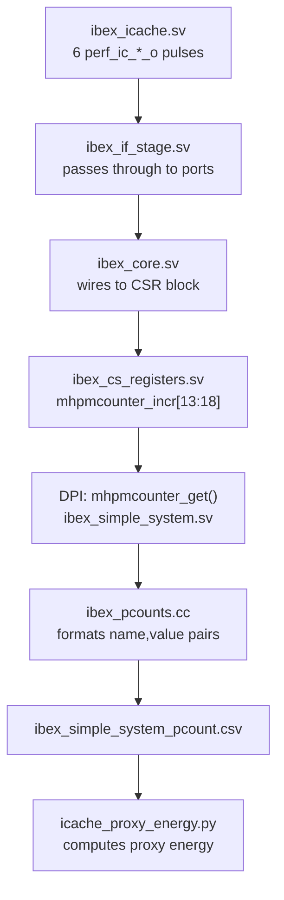

# Performance Counters

This document describes the I-cache performance counters added to the Ibex core for proxy energy measurement.

## Overview

Six one-cycle event pulses were added to `ibex_icache.sv` to track SRAM array activity. These pulses propagate through the core's existing MHPM (Machine Hardware Performance Monitor) counter infrastructure and are exported to CSV at simulation end.

## Event Definitions

Each counter fires a single-cycle pulse when its condition is true:

| Counter | RTL Signal | Condition | What It Captures |
|---------|-----------|-----------|------------------|
| Tag Read | `perf_ic_tag_read_o` | `tag_req_ic0 & ~tag_write_ic0` | Tag SRAM read (lookup, not an allocation write) |
| Data Read | `perf_ic_data_read_o` | `data_req_ic0 & ~data_write_ic0` | Data SRAM read (fetch, not a fill write) |
| Tag Write | `perf_ic_tag_write_o` | `tag_write_ic0` | Tag SRAM write (fill-buffer allocation commits a tag) |
| Data Write | `perf_ic_data_write_o` | `data_write_ic0` | Data SRAM write (fill-buffer allocation commits data) |
| Eviction | `perf_ic_evict_o` | `fill_ram_arb[i] & fill_evict_q[i]` | Allocation overwrites a valid victim line (set was full) |
| Invalidation Tag Write | `perf_ic_inval_tag_write_o` | `inval_write_req` | Tag SRAM write during cache invalidation sweep |

The eviction counter specifically tracks when a fill buffer **commits an allocation write** into a cache line that was previously valid. "Picking a victim way" alone does not count as an eviction; the fill must actually overwrite a valid line.

## Signal Flow (RTL to CSV)



When the I-cache is disabled in the build configuration, `ibex_if_stage.sv` ties all six signals to zero so the counter infrastructure is still present but inactive.

## MHPM Counter Index Map

These counters are appended after the existing Ibex counters (indices 0-12):

| Index | MHPM Input | CSV Name |
|-------|-----------|----------|
| 13 | `ic_tag_read_i` | `I$ Tag Array Reads` |
| 14 | `ic_data_read_i` | `I$ Data Array Reads` |
| 15 | `ic_tag_write_i` | `I$ Tag Array Writes` |
| 16 | `ic_data_write_i` | `I$ Data Array Writes` |
| 17 | `ic_evict_i` | `I$ Evictions` |
| 18 | `ic_inval_tag_write_i` | `I$ Invalidation Tag Writes` |

The build configs (`maxperf-pmp-bmfull-icache-rr-proxy` and `maxperf-pmp-bmfull-icache-plru-proxy`) set `MHPMCounterNum=19` to ensure indices 13-18 exist.

## CSV Export Format

At simulation end, `ibex_simple_system.cc` calls `ibex_pcount_string(true)` which writes a CSV file with one row per counter:

```
Cycles,3112363
Instructions Retired,2754578
...
I$ Tag Array Reads,1938044
I$ Data Array Reads,1938044
I$ Tag Array Writes,35660
I$ Data Array Writes,35660
I$ Evictions,24502
I$ Invalidation Tag Writes,512
```

The counter names in the CSV come from `ibex_pcounts.cc` and must match the `COUNTER_NAMES` dictionary in `icache_proxy_energy.py`.

## Files Modified

RTL (event generation and plumbing):
- `rtl/ibex_icache.sv` — event pulse outputs and logic
- `rtl/ibex_if_stage.sv` — port pass-through and ICache-disabled tie-offs
- `rtl/ibex_core.sv` — wiring from IF stage to CSR block
- `rtl/ibex_cs_registers.sv` — `mhpmcounter_incr[13:18]` assignments and input ports

RTL wrappers (parameter propagation for `ICachePLRU`):
- `rtl/ibex_top.sv`
- `rtl/ibex_top_tracing.sv`
- `rtl/ibex_lockstep.sv`
- `examples/simple_system/rtl/ibex_simple_system.sv`
- `dv/riscv_compliance/rtl/ibex_riscv_compliance.sv`
- `dv/uvm/core_ibex/tb/core_ibex_tb_top.sv`
- `dv/uvm/icache/dv/tb/tb.sv`

Build system (FuseSoC `.core` files accepting `ICachePLRU`):
- `ibex_core.core`
- `ibex_top.core`
- `ibex_top_tracing.core`
- `examples/simple_system/ibex_simple_system.core`
- `dv/verilator/simple_system_cosim/ibex_simple_system_cosim.core`
- `dv/riscv_compliance/ibex_riscv_compliance.core`

Configuration and export:
- `ibex_configs.yaml` — added `ICachePLRU` key and two proxy experiment configs
- `util/ibex_config.py` — parser support for `ICachePLRU`
- `dv/verilator/pcount/cpp/ibex_pcounts.cc` — counter name strings for indices 13-18

Analysis:
- `util/icache_proxy_energy.py` — reads CSV, computes proxy energy, writes JSON
