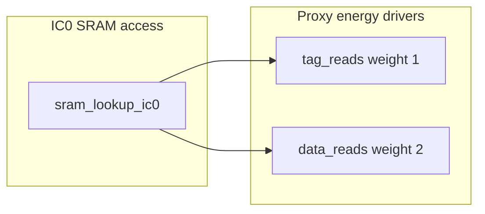

# Ibex ICache power: baseline + one RTL change (`ibex_icache.sv` only)

## 1. Baseline proxy energy (from [ibex_edited/icache_proxy_coremark.json](ibex_edited/icache_proxy_coremark.json))

Formula (same weights as [ibex_edited/util/icache_proxy_energy.py](ibex_edited/util/icache_proxy_energy.py)):

`E = 1.0*tag_reads + 2.0*data_reads + 2.0*tag_writes + 3.0*data_writes + evictions + inval_tag_writes`

**RR (representative):** total **6,009,210**

| Term | RR contribution | Share |
|------|------------------|-------|
| **Data reads** (weight 2.0) | 3,875,320 | **~64.5%** |
| **Tag reads** (weight 1.0) | 1,937,660 | **~32.2%** |
| Data + tag writes | ~196k | ~3.3% |

**Observations**

- `tag_reads == data_reads` (1,937,660) because every lookup cycle that touches SRAM drives **both** tag and data arrays in parallel (`tag_req_ic0` / `data_req_ic0` in [ibex_edited/rtl/ibex_icache.sv](ibex_edited/rtl/ibex_icache.sv)).
- **Reads dominate** proxy energy (~97%); replacement policy (RR vs PLRU) only nudges total energy via slightly fewer fills/writes in the JSON, not read count.

Perf pulses (what your proxy counts):

```370:371:ibex_edited/rtl/ibex_icache.sv
  assign perf_ic_tag_read_o        = tag_req_ic0 & ~tag_write_ic0;
  assign perf_ic_data_read_o       = data_req_ic0 & ~data_write_ic0;
```

So **meaningful** savings require **fewer cycles** where `sram_lookup_ic0` (or equivalent) asserts **read** on tag/data for demand/prefetch lookups.



---

## 2. What is already in this repo (avoid duplicating work)

In [ibex_edited/rtl/ibex_icache.sv](ibex_edited/rtl/ibex_icache.sv):

- **Fill-buffer lookup suppression** is already implemented (`fill_match_ic0`, `fill_addr_line_match`, gates `sram_lookup_ic0` and `lookup_actual_ic0`). This overlaps the “Optimization 2” write-up in [ibex_edited/plans/icache_power_optimization_plan_19304045.plan.md](ibex_edited/plans/icache_power_optimization_plan_19304045.plan.md).
- A **line buffer** exists, but the comment block labels it **branch-target capture**, and **capture** is restricted to **branch** lookups:

```1267:1269:ibex_edited/rtl/ibex_icache.sv
    assign line_buf_capture = lookup_valid_ic1 & tag_hit_ic1 & ~ecc_err_ic1 &
                              branch_ic1 & ~line_buf_hit_ic1;
```

The **same-line hit path** (`line_buf_hit_ic0` → suppress `sram_lookup_ic0`) is already wired; the missing piece for CoreMark-style **sequential** code is that the buffer is **rarely populated** except after **branch** hits.

The written plans in [ibex_edited/plans/](ibex_edited/plans/) describe a **broader** “same-line / line buffer” idea; this proposal is the **concrete RTL delta** that remains in *this* fork: **widen capture**, not re-derive fill suppression or prefetch theory.

---

## 3. One concrete optimization (single iteration)

**Extend line-buffer capture to sequential cache hits (not only branch targets).**

- **Mechanism:** After any **SRAM** lookup that completes as a **hit** in IC1, latch the line tag + line data (+ way mask) into `line_buf_*_q`, exactly as on branch hits today. Then **prefetch** within the same cache line can hit `line_buf_hit_ic0` and **suppress** `tag_req_ic0` / `data_req_ic0` for that cycle (already how `sram_lookup_ic0` is defined).
- **Why it matches the metric:** Cuts **both** `tag_reads` and `data_reads` together—the two dominant terms—with one gating point you already have (`sram_lookup_ic0`).
- **Practical scope:** Edits stay inside `gen_line_buf` and `line_buf_inval` (plus possibly a small combinational **fill vs buffer** compare), without touching other modules.

**Correctness / invalidation (must be part of the same change):**

- Today `line_buf_inval` covers inval / disable / ECC error on buffer hit. If the buffer can hold **any** hit line, you must also **invalidate** when a **fill commits a line write** that **conflicts** with the buffered line (same cache line address, or conservative same-set rules). Otherwise you could skip SRAM while the array content changed underfoot. The multi-option plan file already flags “fill could overwrite that line”; implement that check here using existing fill signals (`fill_ram_arb`, `fill_addr_q`, etc.—all local to this file).

**Overlap with existing plan docs:** This is the **implementation** of the “same-line buffer” **read bypass** described in [ibex_edited/plans/icache_power_optimization_plan_19304045.plan.md](ibex_edited/plans/icache_power_optimization_plan_19304045.plan.md) / [ibex_edited/plans/icache_planner_agent_coremark_op1-2.md](ibex_edited/plans/icache_planner_agent_coremark_op1-2.md), **specialized** to your current RTL where capture is branch-gated. It does **not** repeat fill suppression (already in RTL). If you need a **second** optimization with **no** conceptual overlap with those markdown narratives, the next candidate is **prefetch depth throttling** (`FB_THRESHOLD` / `lookup_req_ic0` gating)—explicitly called out as “Optimization 3” in the same plan file and **not** implemented in RTL today (`FB_THRESHOLD` is still `NUM_FB-2` at line 82).

---

## 4. Signals / regions to edit (only [ibex_edited/rtl/ibex_icache.sv](ibex_edited/rtl/ibex_icache.sv))

| Area | What to change |
|------|------------------|
| **`line_buf_capture`** | Remove or relax the `branch_ic1` requirement so **any** `lookup_valid_ic1 & tag_hit_ic1 & ~ecc_err_ic1 & ~line_buf_hit_ic1` (from a real SRAM lookup) updates the buffer. Keep `~line_buf_hit_ic1` so you do not “re-capture” when the hit was already served from the buffer. |
| **`branch_ic1` FF** | If nothing else needs `branch_ic1`, remove or repurpose to avoid dead logic (only if truly unused after capture change). |
| **`line_buf_inval`** | Add **fill-write conflict** detection (e.g., when a fill RAM write targets the same line identity as `line_buf_tag_q`), OR a conservative rule you can prove safe. |
| **Assertions (optional)** | Strengthen formal/invariant checks near existing `gen_line_buf` if you have them enabled (`FORMAL` region at file end). |

No changes outside this file.

---

## 5. Build parameters — verify before sign-off

You selected **verify in top / fusesoc core / build script**. Before implementation, confirm the **actual** instance parameters for:

- `ICacheECC`, `ICachePLRU`, `BranchCache`, `ICacheLineBuffer`

They change **width** of buffered data (`LineSizeECC`) and whether **branch-only caching** (`BranchCache`) affects fill behavior—relevant when reasoning about invalidation and ECC paths.

---

## 6. Validation

- Re-run CoreMark with the same flow that produced `ibex_simple_system_pcount*.csv` and recompute proxy energy with [ibex_edited/util/icache_proxy_energy.py](ibex_edited/util/icache_proxy_energy.py).
- Check **functional** regressions (UVM/icache DV if part of your course flow) and **performance** (`fetch_wait`, `instret`)—this change should reduce reads with small risk if invalidation is conservative.
