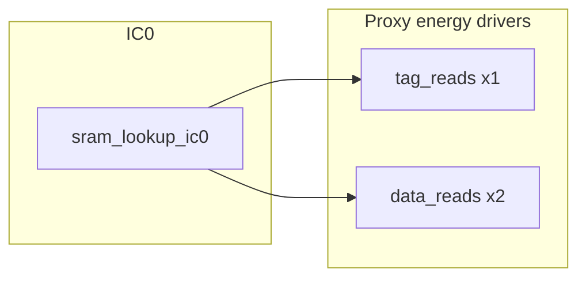

# I$ proxy-energy analysis and one novel RTL optimization

## 1. Baseline power breakdown (from [ibex_edited/icache_proxy_coremark.json](ibex_edited/icache_proxy_coremark.json))

Proxy formula matches [ibex_edited/util/icache_proxy_energy.py](ibex_edited/util/icache_proxy_energy.py):

`E = 1.0*tag_reads + 2.0*data_reads + 2.0*tag_writes + 3.0*data_writes + evictions + inval_tag_writes`

**RR (total 6,009,210)** — representative:

| Term | Contribution | Share |
|------|----------------|-------|
| Data reads (weight 2.0) | 3,875,320 | **~64.5%** |
| Tag reads (weight 1.0) | 1,937,660 | **~32.2%** |
| Tag + data writes | ~196,230 | **~3.3%** |

**Observations**

- `tag_reads == data_reads` (1,937,660): each SRAM lookup cycle asserts both tag and data read paths in parallel ([ibex_edited/rtl/ibex_icache.sv](ibex_edited/rtl/ibex_icache.sv) `tag_req_ic0` / `data_req_ic0` via `sram_lookup_ic0`).
- **Reads dominate** proxy energy; replacement policy (RR vs PLRU) only nudges total energy in this JSON (mostly via slightly fewer writes), not read counts.

**Perf mapping (what the proxy counts)**

```369:371:ibex_edited/rtl/ibex_icache.sv
  assign perf_ic_tag_read_o        = tag_req_ic0 & ~tag_write_ic0;
  assign perf_ic_data_read_o       = data_req_ic0 & ~data_write_ic0;
```

Meaningful savings require **fewer cycles** where `sram_lookup_ic0` is true for demand/prefetch lookups (writes/fills unchanged in intent).



---

## 2. What is already covered (plans + current RTL)

Under your **strict** rule (no reuse of ideas from [ibex_edited/plans/](ibex_edited/plans/)):

- **Line buffer / same-line capture / branch-target buffer** — documented in multiple plan files; RTL already has `ICacheLineBuffer` with **branch-gated** `line_buf_capture` in `gen_line_buf`.
- **Fill-buffer lookup suppression** — documented as “Optimization 2”; **already implemented** as `fill_match_ic0` / `fill_addr_line_match` gating `sram_lookup_ic0`.
- **Prefetch depth via `FB_THRESHOLD` / fill-level throttle / stall-aware output gating** — documented as “Optimization 3”; RTL still uses `FB_THRESHOLD = NUM_FB-2` and `lookup_throttle` from `fb_fill_level`.

So the **novel** proposal below deliberately **does not** change `line_buf_capture`, **does not** duplicate `fill_match_ic0`, and **does not** tune `FB_THRESHOLD` or add `ready_i`-based gating as described in those plan docs.

---

## 3. One novel optimization: cache-line lookahead window (address-gap cap)

**Idea:** Limit **how far ahead** the prefetch address (`prefetch_addr_q`) is allowed to run **in cache-line units** relative to the **line containing the current output PC** (`output_addr_q` / `addr_o`). When the gap exceeds a small `localparam` (e.g. 1–3 lines), **suppress non-branch** `lookup_req_ic0` so the front-end does not keep issuing parallel tag+data SRAM reads for speculative lines while the core is still consuming an earlier line.

**Why it is distinct from existing plan items**

- **`FB_THRESHOLD`** throttles based on **number of busy fill buffers**, not distance in address space.
- **`fill_match_ic0`** suppresses reads when a **fill** already covers the **same** line; it does not cap **how many lines ahead** prefetch has moved while the output stream lags.
- **Line buffer** targets **same-line** reuse; this targets **multi-line** **lookahead** **distance**.

**Why it can reduce proxy energy**

- Each suppressed sequential lookup removes **one** `tag_req` and **one** `data_req` event (same cycle), directly lowering both dominant counter terms until the output stream advances and the gap shrinks.

**Tradeoff**

- May increase **`fetch_wait`** if `N` is too aggressive; tune `N` starting conservative (e.g. 2–4 lines) and validate CoreMark `fetch_wait` / `instret`.

---

## 4. Signals and regions to edit (only [ibex_edited/rtl/ibex_icache.sv](ibex_edited/rtl/ibex_icache.sv))

| Area | Action |
|------|--------|
| **New locals** | `localparam int unsigned PREFETCH_MAX_LINE_GAP = ...` (tunable). Optional registered `output_line_q` aligned to `IC_LINE_W` if you need clean timing vs combinational `output_addr_q`. |
| **Line extractors** | Combinational: `prefetch_line = prefetch_addr_q[ADDR_W-1:IC_LINE_W]`, `output_line = {output_addr_q, 1'b0}[ADDR_W-1:IC_LINE_W]` (or equivalent alignment consistent with existing address fields). |
| **Gap / compare** | Unsigned difference in lines: `prefetch_ahead_lines = prefetch_line - output_line` (or saturated subtract) in **32-bit** address space; define behavior on wrap (typically branch clears concern). |
| **`lookup_req_ic0`** (lines ~268–269) | AND in a term like `branch_i | (prefetch_ahead_lines <= PREFETCH_MAX_LINE_GAP)` (exact form must handle underflow when `prefetch` is behind `output` after redirect—usually `branch_i` or `prefetch_addr_en` makes this rare; use mux or `signed` line delta). |
| **Do not break** | Keep `ecc_write_req` gating, `req_i`, `~&fill_busy_q`, and **branch** priority so redirects are not delayed by the window. |
| **Validation** | Re-run CoreMark pcount CSV and [ibex_edited/util/icache_proxy_energy.py](ibex_edited/util/icache_proxy_energy.py); compare `fetch_wait` and `proxy_energy` to [ibex_edited/icache_proxy_coremark.json](ibex_edited/icache_proxy_coremark.json). |

**Note:** `lookup_grant_ic0` is tied to `lookup_req_ic0` today; narrowing `lookup_req_ic0` automatically reduces grants and slows `prefetch_addr` advancement—consistent with the intent.

---

## 5. Clarifications to confirm before implementation (parameters)

- **`ICacheECC`, `ICachePLRU`, `BranchCache`, `ICacheLineBuffer`:** Confirm values in the **actual** `ibex_icache` instance used for CoreMark (affects ECC width and line-buffer presence, not the **math** of line-gap compare, but matters for regression parity).
- **`PREFETCH_MAX_LINE_GAP`:** Start with a **conservative** value and sweep if your flow allows; this is the main performance vs energy knob.

No synthesis-parameter change is **required** for this optimization unless you choose to expose `PREFETCH_MAX_LINE_GAP` as a module parameter instead of a `localparam`.
